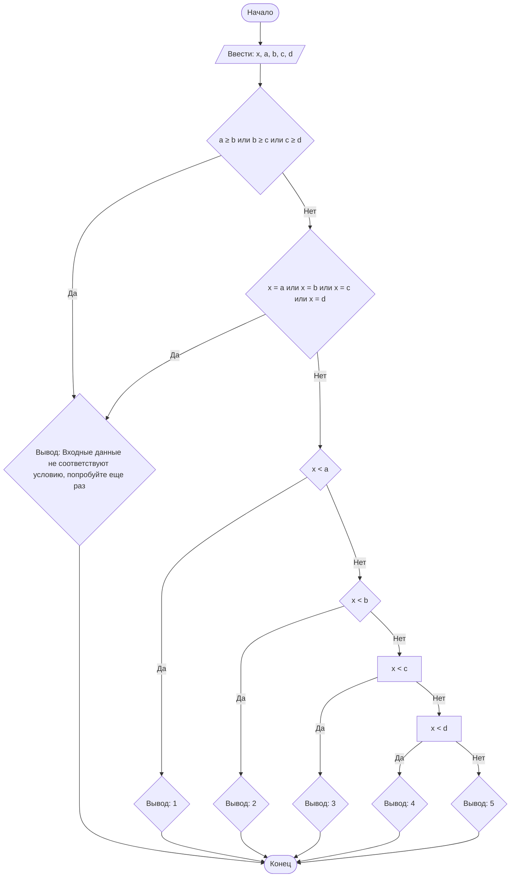

## Отчет по лабораторной работе № 1

#### № группы: `ПМ-2601`

#### Выполнила: `Протченко Ольга Владиславна`

#### Вариант: `19`

### Cодержание:

- [Постановка задачи](#1-постановка-задачи)
- [Входные и выходные данные](#2-входные-и-выходные-данные)
- [Математическая модель](#3-математическая-модель)
- [Выбор структуры данных](#4-выбор-структуры-данных)
- [Алгоритм](#5-алгоритм)
- [Программа](#6-программа)
- [Анализ правильности решения](#7-анализ-правильности-решения)

### 1. Постановка задачи

> На числовой прямой расположены 4 различные точки A, B, C, D (где A < B < C < D), которые разбивают числовую прямую
> на 5 участков (1, 2, 3, 4, 5 слева направо). В какой из участков попадает точка X? Известно, что X не равна
> ни одной из точек A, B, C, D. На вход программы подаются целые числа X, A, B, C, D.

Всего надо рассмотреть `4 + 1 = 5` случаев.

### 2. Входные и выходные данные

#### Данные на вход

На вход программа должна получать 5 целых чисел. 
Ограничения по величине входных данных в условии отсутствуют.

|             | Тип         | min значение | max значение       |
|-------------|-------------|--------------|--------------------|
| X (Число 1) | Целое число | - 2<sup>31   | 2<sup>31</sup> - 1 |
| A (Число 2) | Целое число | - 2<sup>31   | 2<sup>31</sup> - 1 |
| B (Число 3) | Целое число | - 2<sup>31   | 2<sup>31</sup> - 1 |
| C (Число 4) | Целое число | - 2<sup>31   | 2<sup>31</sup> - 1 |
| D (Число 5) | Целое число | - 2<sup>31   | 2<sup>31</sup> - 1 |

#### Данные на выход

Программа должна вывести одно целое число от 1 до 5 — номер участка, в который попадает точка X.

|         | Тип                          | min значение | max значение |
|---------|------------------------------|--------------|--------------|
| Число 1 | Целое неотрицательное число  | 1            | 5            |

### 3. Математическая модель
Так как точки упорядочены (A < B < C < D), числовая прямая разбивается на следующие интервалы:

`Участок 1: (−∞;A)`                                                                        
`Участок 2: (A;B)`                                                                           
`Участок 3: (B;C)`                                                                                
`Участок 4: (C;D)`                                                                             
`Участок 5: (D;+∞)`                                                                             

Поскольку по условию `X≠A, X≠B, X≠C, X≠D`, используются строгие неравенства. Задача сводится к последовательной проверке условий вхождения числа X в один из заданных интервалов.

### 4. Выбор структуры данных

Программа получает 5 целых чисел, лежащих в промежутке [-2<sup>31; 2<sup>31 - 1]. Поэтому для их хранения
можно выделить 5 переменных (`x`, `a`, `b`, `c` и `d`) типа `int`.

|             | название переменной | Тип (в Java) | 
|-------------|---------------------|--------------|
| X (Число 1) | `x`                 | `int`        |
| A (Число 2) | `a`                 | `int`        | 
| B (Число 3) | `b`                 | `int`        | 
| C (Число 4) | `c`                 | `int`        | 
| D (Число 5) | `d`                 | `int`        | 

Для вывода результата необязательно его хранить в отдельной переменной.

### 5. Алгоритм

#### Алгоритм выполнения программы:

1. **Ввод данных:**  
   Программа считывает пять целых чисел, обозначенные как `x`, `a`, `b`, `c` и `d`.

2. **Проверка выполнения условия A < B < C < D:**
   - Проверить условие: если A ≥ B или B ≥ C или C ≥ D, то вывести ошибку.
   > Программа попарно сравнивает значения `a` и `b`, `b` и `c` и `c` и `d`. Если какое-то из условий не выполняется,
   > программа выводит на экран предупреждение: "Входные данные не соответствуют условию, попробуйте еще раз"
   
4. **Проверка выполнения условия X≠A, X≠B, X≠C, X≠D:**
   - Проверить условие: если X = A или X = B или X = C или X = D, то вывести ошибку.
   > Программа попарно сравнивает значения `x` и `a`, `x` и `b`, `x` и `c` и `x` и `d`. Если какое-то из условий не выполняется,
   > программа выводит на экран предупреждение: "Входные данные не соответствуют условию, попробуйте еще раз"

6. **Проверка условия попадания в промежутки и вывод данных на экран:**
    - Проверить условие: если X < A, то вывести 1.
   >Программа сравнивает значения `x` и `a`. Если `x` больше `a`, программа переходит к следующему условию
   >для сравнения `x`. Если `x` меньше `a`, программа выводит на экран `1`.
    - Иначе, если X < B, то вывести 2.
   >Программа сравнивает значения `x` и `b`. Если `x` больше `b`, программа переходит к следующему условию для
   сравнения `x`. Если `x` меньше `b`, программа выводит на экран `2`.
    - Иначе, если X < C, то вывести 3.
   >Программа сравнивает значения `x` и `c`. Если `x` больше `c`, программа переходит к следующему условию для
   сравнения `x`. Если `x` меньше `c`, программа выводит на экран `3`.
    - Иначе, если X < D, то вывести 4.
   >Программа сравнивает значения `x` и `d`. Если `x` больше `d`, программа переходит к следующему блоку.
   Если `x` меньше `d`, программа выводит на экран `4`.
    - Иначе (если X > D), вывести 5.
    >Программа выводит на экран `5`.
   

#### Блок-схема



### 6. Программа

```java
import java.io.PrintStream;
import java.util.Scanner;
public class Main {
    public static Scanner in = new Scanner(System.in);
    public static PrintStream out = System.out;
    public static void main(String[] args) {
        // вводим значение точки Х
        int x = in.nextInt();
        // вводим значения A, B, C и D
        int a = in.nextInt();
        int b = in.nextInt();
        int c = in.nextInt();
        int d = in.nextInt();
        // проверка выполнения условия A < B < C < D
        if (a >= b || b >= c || c >= d)
            out.println("Входные данные не соответствуют условию, попробуйте еще раз");
        else {
            // иначе, проверка выполнения условия X≠A, X≠B, X≠C, X≠D
            if (x == a || x == b || x == c || x == d)
                out.println("Входные данные не соответствуют условию, попробуйте еще раз");
            else {
                // иначе, проверка на попадание в участок 1
                if (x < a)
                    out.println(1);
                else {
                    // иначе, проверка на попадание в участок 2
                    if (x < b)
                        out.println(2);
                    else {
                        // иначе, проверка на попадание в участок 3
                        if (x < c)
                            out.println(3);
                        else {
                            // иначе, проверка на попадание в участок 4
                            if (x < d)
                                out.println(4);
                            // иначе, попадание в участок 5
                            else
                                out.println(5);
                        }
                    }
                }
            }
        }
    }
}
```

### 7. Анализ правильности решения

Программа работает корректно на всем множестве решений с учетом ограничений.

1. Тест на принадлежность `X` к `участку 1` на числовой прямой:

    - **Input**:
        ```
        0.5 1.5 2.5 3.5 4.5
        ```

    - **Output**:
        ```
        1
        ```

2. Тест на принадлежность `X` к `участку 2` на числовой прямой:

    - **Input**:
        ```
        -7.5 -10.2 -5.5 -2.1 0.0
        ```

    - **Output**:
        ```
        2
        ```

3. Тест на принадлежность `X` к `участку 3` на числовой прямой:

    - **Input**:
        ```
        2.3 -15.5 -1.2 5.5 10.1
        ```

    - **Output**:
        ```
        3
        ```

4. Тест на принадлежность `X` к `участку 4` на числовой прямой:

    - **Input**:
        ```
        75.75 10.05 50.55 99.99 150.5
        ```

    - **Output**:
        ```
        4
        ```

5. Тест на принадлежность `X` к `участку 4` на числовой прямой:

    - **Input**:
        ```
        0.5 -100.5 -50.25 -10.1 -1.05
        ```

    - **Output**:
        ```
        5
        ```

 6. Тест на выполнение условия `A < B < C < D`:

    - **Input**:
        ```
        5.5 1.1 3.3 2.2 4.4
        ```

    - **Output**:
        ```
        Входные данные не соответствуют условию, попробуйте еще раз
        ```  
7. Тест на выполнение условия `X≠A, X≠B, X≠C, X≠D`:

    - **Input**:
        ```
        -2.5 -10.5 -5.5 -2.5 1.5
        ```

    - **Output**:
        ```
        Входные данные не соответствуют условию, попробуйте еще раз
        ```  
