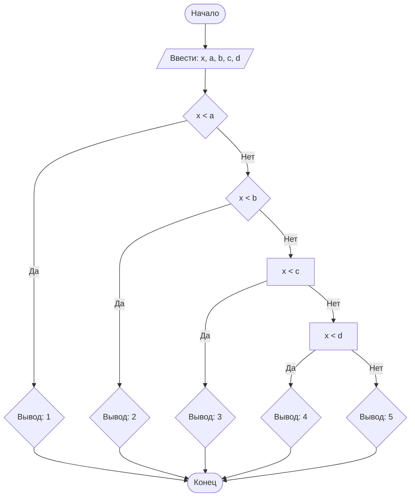

## Отчет по лабораторной работе № 1

#### № группы: `ПМ-2601`

#### Выполнила: `Протченко Ольга Владиславна`

#### Вариант: `19`

### Cодержание:

- [Постановка задачи](#1-постановка-задачи)
- [Входные и выходные данные](#2-входные-и-выходные-данные)
- [Математическая модель](#3-математическая-модель)
- [Выбор структуры данных](#4-выбор-структуры-данных)
- [Алгоритм](#5-алгоритм)
- [Программа](#6-программа)
- [Анализ правильности решения](#7-анализ-правильности-решения)

### 1. Постановка задачи

> На числовой прямой расположены 4 различные точки A, B, C, D (где A < B < C < D), которые разбивают числовую прямую
> на 5 участков (1, 2, 3, 4, 5 слева направо). В какой из участков попадает точка X? Известно, что X не равна
> ни одной из точек A, B, C, D. На вход программы подаются целые числа X, A, B, C, D.

Всего надо рассмотреть `4 + 1 = 5` случаев.

### 2. Входные и выходные данные

#### Данные на вход

На вход программа должна получать 5 чисел, при этом в условии не сказано, к какому множеству
принадлежат получаемые числа, поэтому будем считать их вещественными. 
Ограничения по величине входных данных в условии отсутствуют.

|             | Тип                | min значение           | max значение         |
|-------------|--------------------|------------------------|----------------------|
| X (Число 1) | Вещественное число | -1.79⋅10<sup>308</sup> | 1.79⋅10<sup>308</sup> |
| A (Число 2) | Вещественное число | -1.79⋅10<sup>308</sup> | 1.79⋅10<sup>308</sup> |
| B (Число 3) | Вещественное число | -1.79⋅10<sup>308</sup> | 1.79⋅10<sup>308</sup> |
| C (Число 4) | Вещественное число | -1.79⋅10<sup>308</sup> | 1.79⋅10<sup>308</sup> |
| D (Число 5) | Вещественное число | -1.79⋅10<sup>308</sup> | 1.79⋅10<sup>308</sup> |

#### Данные на выход

Программа должна вывести одно целое число от 1 до 5 — номер участка, в который попадает точка X.

|         | Тип                          | min значение | max значение |
|---------|------------------------------|--------------|--------------|
| Число 1 | Целое неотрицательное число  | 1            | 5            |

### 3. Математическая модель
Так как точки упорядочены (A < B < C < D), числовая прямая разбивается на следующие интервалы:

`Участок 1: (−∞;A)`                                                                        
`Участок 2: (A;B)`                                                                           
`Участок 3: (B;C)`                                                                                
`Участок 4: (C;D)`                                                                             
`Участок 5: (D;+∞)`                                                                             

Поскольку по условию `X≠A, X≠B, X≠C, X≠D`, используются строгие неравенства. Задача сводится к последовательной проверке условий вхождения числа X в один из заданных интервалов.

### 4. Выбор структуры данных

Программа получает 5 вещественных чисел, не превышающих по модулю 10<sup>9</sup> < 2<sup>30</sup>. Поэтому для их хранения
можно выделить 5 переменных (`x`, `a`, `b`, `c` и `d`) типа `double`.

|             | название переменной | Тип (в Java) | 
|-------------|---------------------|--------------|
| X (Число 1) | `x`                 | `double`     |
| A (Число 2) | `a`                 | `double`     | 
| B (Число 3) | `b`                 | `double`     | 
| C (Число 4) | `c`                 | `double`     | 
| D (Число 5) | `d`                 | `double`     | 

Для вывода результата необязательно его хранить в отдельной переменной.

### 5. Алгоритм

#### Алгоритм выполнения программы:

1. **Ввод данных:**  
   Программа считывает пять вещественных чисел, обозначенные как `x`, `a`, `b`, `c` и `d`.

2. **Проверка условия попадания в промежутки и вывод данных на экран:**
    - Проверить условие: если X < A, то вывести 1.
   >Программа сравнивает значения `x` и `a`. Если `x` больше `a`, программа переходит к следующему условию
   >для сравнения `x`. Если `x` меньше `a`, программа выводит на экран `1`.
    - Иначе, если X < B, то вывести 2.
   >Программа сравнивает значения `x` и `b`. Если `x` больше `b`, программа переходит к следующему условию для
   сравнения `x`. Если `x` меньше `b`, программа выводит на экран `2`.
    - Иначе, если X < C, то вывести 3.
   >Программа сравнивает значения `x` и `c`. Если `x` больше `c`, программа переходит к следующему условию для
   сравнения `x`. Если `x` меньше `c`, программа выводит на экран `3`.
    - Иначе, если X < D, то вывести 4.
   >Программа сравнивает значения `x` и `d`. Если `x` больше `d`, программа переходит к следующему блоку.
   Если `x` меньше `d`, программа выводит на экран `4`.
    - Иначе (если X > D), вывести 5.
    >Программа выводит на экран `5`.
   

#### Блок-схема



### 6. Программа

```java
import java.io.PrintStream;
import java.util.Scanner;
public class Main {
    public static Scanner in = new Scanner(System.in);
    public static PrintStream out = System.out;
    public static void main(String[] args) {
        double x = in.nextDouble();
        double a = in.nextDouble();
        double b = in.nextDouble();
        double c = in.nextDouble();
        double d = in.nextDouble();
        if (x < a) out.println(1);
        else {
            if (x < b) out.println(2);
            else {
                if (x < c) out.println(3);
                else {
                    if (x < d) out.println(4);
                    else out.println(5);
                }
            }
        }
    }
}
```

### 7. Анализ правильности решения

Программа работает корректно на всем множестве решений с учетом ограничений.

1. Тест на принадлежность `X` к `участку 1` на числовой прямой:

    - **Input**:
        ```
        0.5 1.5 2.5 3.5 4.5
        ```

    - **Output**:
        ```
        1
        ```

2. Тест на принадлежность `X` к `участку 2` на числовой прямой:

    - **Input**:
        ```
        -7.5 -10.2 -5.5 -2.1 0.0
        ```

    - **Output**:
        ```
        2
        ```

3. Тест на принадлежность `X` к `участку 3` на числовой прямой:

    - **Input**:
        ```
        2.3 -15.5 -1.2 5.5 10.1
        ```

    - **Output**:
        ```
        3
        ```

4. Тест на принадлежность `X` к `участку 4` на числовой прямой:

    - **Input**:
        ```
        75.75 10.05 50.55 99.99 150.5
        ```

    - **Output**:
        ```
        4
        ```

5. Тест на принадлежность `X` к `участку 4` на числовой прямой:

    - **Input**:
        ```
        0.5 -100.5 -50.25 -10.1 -1.05
        ```

    - **Output**:
        ```
        5
        ```
